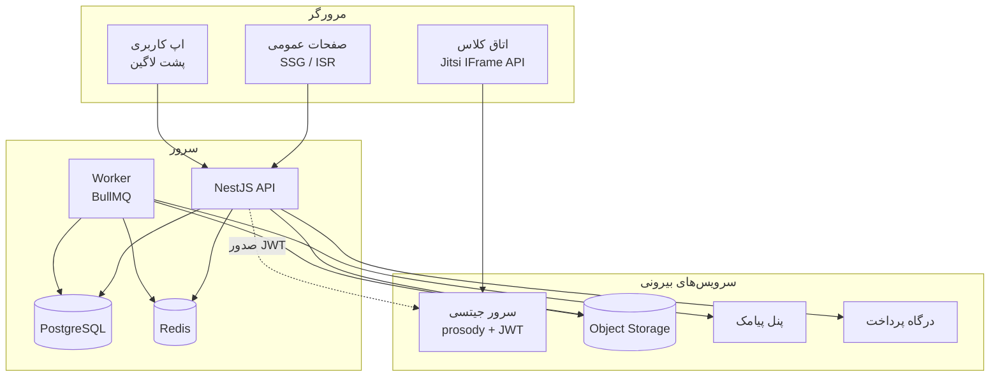
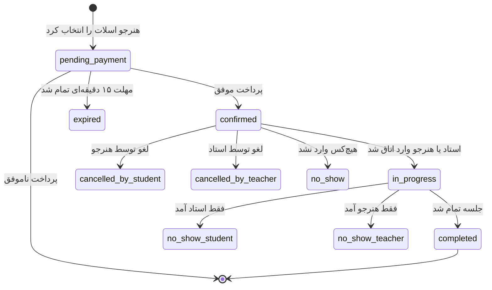
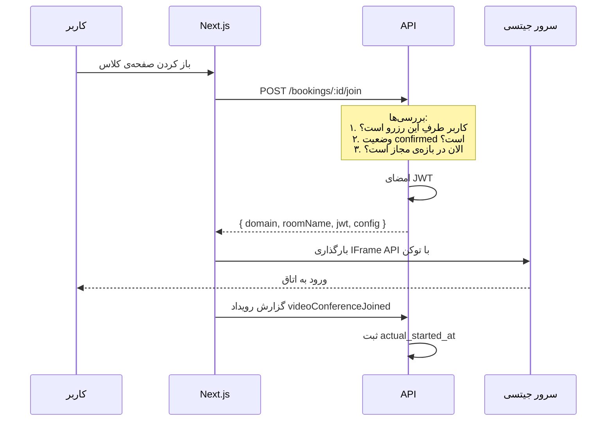

# معماری پلتفرم کلاس آنلاین موسیقی

> سند طراحی — نسخه‌ی اول، مرداد ۱۴۰۵
> این سند نقشه‌ی بلندمدته. بخش «فازبندی» مشخص می‌کنه چه چیزی در MVP ساخته می‌شه و چه چیزی نه.

---

## ۱. خلاصه‌ی محصول

مارکت‌پلیس آموزش خصوصی موسیقی به‌صورت آنلاین. هنرجو ساز و استاد را انتخاب می‌کند، جلسه رزرو می‌کند، کلاس زنده روی سرور جیتسیِ اختصاصی برگزار می‌شود، و بعد از کلاس چرخه‌ی تمرین ادامه پیدا می‌کند.

**سه نقش:** هنرجو، استاد، ادمین.

**دو نوع سرویس (فاز اول فقط اولی):**
1. کلاس زنده‌ی خصوصی
2. دوره‌های ضبط‌شده‌ی آماده — *خارج از محدوده‌ی فعلی*

**سه مدل خرید کلاس زنده:**

| نوع | توضیح | قیمت |
|---|---|---|
| جلسه‌ی معارفه | ۲۰ دقیقه، آشنایی با استاد و سبک | رایگان، یک‌بار برای همیشه به ازای هر کاربر |
| جلسه‌ی تکی | یک جلسه، تاریخ و ساعت دلخواه | قیمت استاد |
| پکیج ماهانه | ۴ جلسه، هفته‌ای یکی، روز و ساعت ثابت | قیمت استاد × ۴ (با تخفیف احتمالی) |

**حلقه‌ی نگهداشت:** کلاس زنده ← ثبت نکات جلسه ← تعیین برنامه‌ی تمرین ← آپلود اجرای هنرجو ← بازخورد استاد ← جلسه‌ی بعد.

این حلقه صرفاً یک قابلیت نیست؛ پاسخ اصلی به ریسک «استاد و هنرجو بعد از جلسه‌ی اول از پلتفرم خارج شوند» است.

---

## ۲. استک

| لایه | انتخاب | دلیل |
|---|---|---|
| فرانت‌اند | Next.js (App Router) + TypeScript | نیاز به SEO برای بخش عمومی؛ App Router امکان ترکیب SSG و کلاینت‌ساید را در یک پروژه می‌دهد |
| استایل | Tailwind + RTL، فونت وزیرمتن | |
| بک‌اند | NestJS + TypeScript | اشتراک تایپ با فرانت، اکوسیستم مناسب یکپارچه‌سازی‌های ایرانی |
| دیتابیس | PostgreSQL | نیاز به `tstzrange` و exclusion constraint برای جلوگیری از تداخل رزرو |
| لایه‌ی داده | Drizzle + postgres.js | اسکیما در TypeScript، مایگریشن‌ها SQL خام و قابل ویرایش، بدون باینری جدا |
| صف و کش | Redis + BullMQ | یادآوری‌ها، چرخه‌ی حیات جلسه، پاک‌سازی فایل‌ها |
| ذخیره‌سازی | آبجکت‌استوریج S3-compatible (آروان‌کلاد یا لیارا) | از داخل ایران سریع، CDN دارد |
| ویدیو کنفرانس | جیتسی self-hosted + احراز هویت JWT | |
| پیامک | کاوه‌نگار یا مشابه | ورود با OTP و یادآوری‌ها |
| پرداخت | زرین‌پال (یا مشابه) | |
| تاریخ | `date-fns-jalali` یا `dayjs` + `jalaliday` | فقط در لایه‌ی نمایش |

> **چرا Drizzle و نه Prisma:** انتخاب اول پریزما بود و کنار گذاشته شد.
> دلیل تعیین‌کننده این بود که مهم‌ترین قید کل سیستم — همان
> `EXCLUDE USING gist` که تداخل رزرو را ناممکن می‌کند — و همچنین
> `CHECK`ها و `btree_gist` را پریزما در زبان اسکیمای خودش بیان نمی‌کند.
> نتیجه این می‌شد که مایگریشن‌های دست‌نویس به‌عنوان راه فرار کنار
> مایگریشن‌های تولیدشده بنشینند.
>
> با Drizzle، ۱۹ قید `CHECK` مستقیماً از تعریف جدول‌ها تولید می‌شوند و
> مایگریشن سفارشی برای `EXCLUDE` جزو جریان عادی کار است، نه استثنا.
> ضمناً پریزما یک موتور کوئری Rust جدا حمل می‌کند که ایمیج دیپلوی را
> سنگین و کولد استارت را کند می‌کند.

**قواعد ثابت:**
- همه‌ی زمان‌ها در دیتابیس `timestamptz` و به وقت UTC ذخیره می‌شوند.
- تبدیل به شمسی و به `Asia/Tehran` فقط در لایه‌ی نمایش انجام می‌شود.
- ایران از ۱۴۰۱ ساعت تابستانی ندارد، پس آفست ثابت `+03:30` است — این یک ساده‌سازی مهم است.
- نام جدول‌ها و فیلدها انگلیسی؛ فقط محتوای رو به کاربر فارسی.

---

## ۳. معماری کلان



**نکته‌ی کلیدی:** فرانت‌اند هیچ‌وقت مستقیم با جیتسی احراز هویت نمی‌کند. توکن ورود به اتاق را فقط API صادر می‌کند، آن هم بعد از بررسی اینکه کاربر واقعاً پول داده و الان زمان کلاسش است.

---

## ۴. مدل داده

### ۴.۱ هویت

```
users
  id              uuid pk
  phone           varchar unique          -- شناسه‌ی اصلی، ورود با OTP
  full_name       varchar
  avatar_url      varchar null
  is_admin        boolean default false
  trial_used_at   timestamptz null        -- جلوگیری از سوءاستفاده از جلسه‌ی رایگان
  status          enum(active, suspended)
  created_at      timestamptz
```

- ایمیل و پسورد نداریم. ورود فقط با شماره‌ی موبایل و کد پیامکی.
- کدهای OTP در Redis با TTL نگه‌داری می‌شوند، نه در دیتابیس.
- هر کاربر می‌تواند هم‌زمان هنرجو و استاد باشد. «استاد بودن» با وجود رکورد در `teacher_profiles` مشخص می‌شود، نه با فیلد نقش.

```
refresh_tokens
  id, user_id, token_hash, expires_at, revoked_at, user_agent
```

### ۴.۲ کاتالوگ و قیمت‌گذاری

```
instruments
  id              uuid pk
  slug            varchar unique          -- classical-guitar, santoor
  name_fa         varchar                 -- گیتار کلاسیک
  description_fa  text                    -- محتوای صفحه‌ی لندینگ سئو
  icon_url        varchar null
  sort_order      int
  is_active       boolean
```

```
teacher_profiles
  id                uuid pk
  user_id           uuid fk unique
  slug              varchar unique        -- برای URL سئو
  headline          varchar               -- «مدرس گیتار کلاسیک، ۱۲ سال سابقه»
  bio               text
  intro_video_url   varchar null          -- ویدیوی معارفه، مهم برای نرخ تبدیل
  years_experience  int
  commission_rate   decimal(5,2)          -- درصد پلتفرم، قابل مذاکره به ازای هر استاد
  status            enum(pending, approved, suspended)
  created_at        timestamptz
```

```
offerings                                 -- واحد قیمت‌گذاری: جفتِ (استاد، ساز)
  id                uuid pk
  teacher_id        uuid fk
  instrument_id     uuid fk
  price             bigint                -- ریال
  duration_minutes  int                   -- معمولاً ۴۵ یا ۶۰
  levels            enum[] (beginner, intermediate, advanced)
  is_active         boolean

  unique (teacher_id, instrument_id)
```

**چرا `offerings` جداست:** یک استاد ممکن است گیتار را ۳۰۰ هزار و تئوری موسیقی را ۲۰۰ هزار تدریس کند. قیمت روی استاد نیست، روی ترکیب استاد و ساز است. چون گفته شد ساز مدام اضافه می‌شود، `instruments` باید جدول باشد نه enum.

### ۴.۳ دسترس‌پذیری — بخش سخت

```
availability_rules                        -- پنجره‌های هفتگی تکرارشونده
  id            uuid pk
  teacher_id    uuid fk
  weekday       smallint                  -- ۰=شنبه ... ۶=جمعه
  start_minute  int                       -- دقیقه از نیمه‌شب، به وقت تهران
  end_minute    int
  valid_from    date
  valid_until   date null
```

```
availability_exceptions                   -- استثناهای تک‌روزه
  id            uuid pk
  teacher_id    uuid fk
  date          date
  type          enum(BLOCK, EXTRA)        -- «این شنبه نیستم» یا «این پنجشنبه استثنائاً هستم»
  start_minute  int null                  -- null یعنی کل روز
  end_minute    int null
  reason        varchar null
```

> **چرا `int` به‌جای `time`:** ساعت روز به صورت «دقیقه از نیمه‌شب» (۰ تا
> ۱۴۳۹) ذخیره می‌شود. تایپ `time` در پستگرس و در درایورها به تاریخ و
> منطقه‌ی زمانی گره می‌خورد و در رفت‌وبرگشت با جاوااسکریپت ابهام
> می‌سازد. حساب صحیح این ابهام را کاملاً حذف می‌کند و محاسبات بازه‌ای
> را ساده‌تر می‌کند.

> **تصمیم معماری مهم:** اسلات‌های آزاد در دیتابیس ذخیره **نمی‌شوند**. هر بار به‌صورت محاسباتی به‌دست می‌آیند:
>
> `قوانین هفتگی − استثناهای block + استثناهای extra − رزروهای فعال − بافر بین جلسات`
>
> ماتریالایز کردن اسلات‌ها (ساختن رکورد برای تک‌تک بازه‌های آزاد) در نگاه اول ساده‌تر است، ولی به محض اینکه استاد قانون دسترسی‌اش را عوض کند باید هزاران رکورد آینده را همگام‌سازی کنی. این منبع پایان‌ناپذیر باگ است.
>
> نتیجه‌ی محاسبه با کلید `availability:{teacher_id}:{month}` در Redis کش می‌شود و با هر تغییر در قوانین یا رزروها باطل می‌شود.

### ۴.۴ رزرو و ثبت‌نام

```
enrollments                               -- پکیج ماهانه
  id                  uuid pk
  student_id          uuid fk
  offering_id         uuid fk
  sessions_total      int default 4
  weekday             smallint            -- روز ثابت هفتگی
  time_of_day         time                -- ساعت ثابت
  start_date          date
  price_total         bigint              -- اسنپ‌شات
  status              enum(pending_payment, active, completed, cancelled)
  created_at          timestamptz
```

```
bookings                                  -- واحد اصلی سیستم: یک جلسه
  id                    uuid pk
  student_id            uuid fk
  teacher_id            uuid fk
  offering_id           uuid fk
  enrollment_id         uuid fk null      -- پر است اگر جزو پکیج باشد
  session_index         int null          -- جلسه‌ی چندم از پکیج (۱ تا ۴)

  type                  enum(trial, single, package)
  scheduled_at          timestamptz
  duration_minutes      int

  status                enum(...)         -- ماشین حالت، بخش ۵
  hold_expires_at       timestamptz null  -- نگه‌داشتن موقت اسلات تا پرداخت

  price_snapshot        bigint            -- کپی، نه ارجاع به offering
  commission_snapshot   decimal(5,2)

  room_id               uuid unique       -- نام اتاق جیتسی، غیرقابل حدس
  actual_started_at     timestamptz null  -- از رویدادهای جیتسی
  actual_ended_at       timestamptz null

  cancelled_at          timestamptz null
  cancelled_by          uuid fk null
  cancellation_reason   text null
  created_at            timestamptz
```

**دو تصمیم مهم در این جدول:**

**۱. اسنپ‌شات قیمت.** `price_snapshot` و `commission_snapshot` کپی می‌شوند، نه ارجاع. اگر استاد فردا قیمتش را زیاد کند، نباید روی پکیجی که دیروز فروخته شده اثر بگذارد. همین‌طور اگر درصد کمیسیون یک استاد تغییر کند، تسویه‌های گذشته نباید جابه‌جا شوند.

**۲. جلوگیری از تداخل در سطح دیتابیس.** بررسی تداخل در کد اپلیکیشن همیشه شرایط رقابتی دارد — دو نفر هم‌زمان یک اسلات را می‌زنند، هر دو کوئری «آزاد است؟» را می‌بینند، هر دو موفق می‌شوند. پستگرس این را قطعی حل می‌کند:

```sql
CREATE EXTENSION IF NOT EXISTS btree_gist;

ALTER TABLE bookings ADD CONSTRAINT bookings_no_teacher_overlap
EXCLUDE USING gist (
  teacher_id WITH =,
  tstzrange(scheduled_at, ends_at) WITH &&
)
WHERE (status IN ('PENDING_PAYMENT', 'CONFIRMED', 'IN_PROGRESS'));
```

با این قید، تداخل از نظر فیزیکی غیرممکن می‌شود. کد فقط باید خطای قید را بگیرد و پیام مناسب بدهد. قید مشابهی روی `student_id` هم هست، چون هنرجو ممکن است با دو استاد مختلف تصادفاً یک ساعت را رزرو کند.

> **چرا `ends_at` ستون واقعی است و محاسبه‌ای نیست:**
>
> فرم بدیهی‌تر این بود که پایان جلسه درون خود قید حساب شود:
> `tstzrange(scheduled_at, scheduled_at + make_interval(mins => duration_minutes))`.
> پستگرس این را رد می‌کند:
>
> ```
> ERROR: functions in index expression must be marked IMMUTABLE
> ```
>
> قید `EXCLUDE` پشت صحنه یک ایندکس GiST می‌سازد و ایندکس فقط عبارت
> IMMUTABLE می‌پذیرد. عملگر `timestamptz + interval` در پستگرس STABLE
> است نه IMMUTABLE، چون نتیجه‌اش می‌تواند به تنظیم منطقه‌ی زمانی نشست
> وابسته باشد.
>
> پس `ends_at` ستون ذخیره‌شده است و اپلیکیشن آن را می‌نویسد. برای اینکه
> هیچ مسیری نتواند مقدار ناسازگار بنویسد، یک `CHECK` جدا نگهبانی می‌کند:
>
> ```sql
> CHECK (ends_at = scheduled_at + make_interval(mins => duration_minutes))
> ```
>
> `CHECK` برخلاف ایندکس، عبارت STABLE را می‌پذیرد. ترکیب این دو یعنی
> ناسازگاری با خطا رد می‌شود، نه اینکه بی‌صدا اصلاح شود.
>
> شرط `WHERE` قید باید همیشه با `SLOT_OCCUPYING_STATUSES` در
> `packages/shared/src/enums.ts` یکی بماند.

**منطق پکیج ماهانه:** موقع خرید، هر ۴ جلسه در یک تراکنش دیتابیس ساخته می‌شوند. اگر حتی یکی از ۴ هفته‌ی آینده تداخل داشته باشد، کل تراکنش رول‌بک می‌شود و به هنرجو گفته می‌شود کدام هفته آزاد نیست. این باعث می‌شود جابه‌جایی یک جلسه‌ی وسط پکیج، بقیه را خراب نکند — چون هر جلسه رکورد مستقل خودش را دارد.

### ۴.۵ مالی

```
orders
  id                  uuid pk
  student_id          uuid fk
  amount              bigint
  status              enum(pending, paid, failed, refunded)
  gateway             varchar
  gateway_authority   varchar null        -- شناسه‌ی درگاه در مرحله‌ی شروع
  gateway_ref_id      varchar null        -- کد رهگیری نهایی
  paid_at             timestamptz null
  created_at          timestamptz
```

```
order_items
  id, order_id, booking_id null, enrollment_id null, amount
```

```
ledger_entries                            -- فقط افزودنی، هرگز ویرایش یا حذف
  id              uuid pk
  type            enum(earning, refund, payout, adjustment)
  order_id        uuid fk null
  booking_id      uuid fk null
  teacher_id      uuid fk null
  gross_amount    bigint
  commission      bigint
  net_amount      bigint
  description     varchar
  created_at      timestamptz
```

```
payouts                                   -- تسویه با استاد؛ در MVP دستی
  id, teacher_id, period_start, period_end,
  amount, status, paid_at, tracking_code, note
```

> دفتر کل را از روز اول بساز. اضافه کردن حسابداری به سیستمی که چند ماه بدون آن کار کرده، یعنی بازسازی تاریخچه از روی داده‌های ناقص.

> **وضعیت پیاده‌سازی.** ماژول پرداخت ساخته شده و این جدول‌ها را واقعاً
> پر می‌کند. سه نکته که موقع ساختنش تثبیت شد:
>
> - **بازپرداخت سطر منفی است، نه ویرایش.** `negateSplit` قرینه‌ی دقیق
>   سطر درآمد را می‌سازد، پس جمع ساده‌ی `net_amount` عدد درست را می‌دهد
>   و هیچ‌جا لازم نیست «منهای بازپرداخت‌ها» حساب شود.
> - **برگرداندن واقعی پول به کارت در این فاز دستی است.** درگاه‌های
>   ایرانی استرداد خودکار را به همه‌ی پذیرنده‌ها نمی‌دهند. آنچه ثبت
>   می‌شود بدهی است، نه انتقال وجه.
> - **نوع `ADJUSTMENT` یک کاربر واقعی پیدا کرد:** پولی که گرفته شد ولی
>   جلسه‌ای پشتش قطعی نشد (مهلت رزرو دقیقاً در فاصله‌ی رفتن به درگاه و
>   برگشتن تمام شد). رزرو را نمی‌شود زنده کرد چون اسلاتش را از دست
>   داده، ولی پول هم نباید بی‌صدا گم شود.

### ۴.۶ چرخه‌ی یادگیری

```
session_notes                             -- نکات جلسه، استاد حین یا بعد کلاس می‌نویسد
  id, booking_id, teacher_id, content, created_at, updated_at
```

```
assignments                               -- برنامه‌ی تمرین
  id            uuid pk
  booking_id    uuid fk                   -- تمرینِ کدام جلسه
  teacher_id    uuid fk
  student_id    uuid fk
  title         varchar
  description   text
  attachments   jsonb                     -- نت، تبلچر، فایل صوتی نمونه
  due_date      date null
  status        enum(assigned, submitted, reviewed)
  created_at    timestamptz
```

```
submissions                               -- اجرای هنرجو
  id, assignment_id, student_id,
  media_url, media_type enum(audio, video),
  duration_seconds, size_bytes,
  created_at
```

```
feedbacks                                 -- بازخورد استاد
  id, submission_id, teacher_id,
  content text null,
  voice_note_url varchar null,            -- بازخورد صوتی؛ برای موسیقی طبیعی‌تر و ارزان‌تر
  created_at
```

```
recordings                                -- ضبط جلسه (فاز دوم)
  id, booking_id, url, type enum(audio, video),
  size_bytes, duration_seconds,
  expires_at,                             -- سیاست نگه‌داری
  status enum(processing, ready, expired, failed)
```

**اقتصاد ذخیره‌سازی — چرا این تفکیک مهم است:**

| نوع | حجم تقریبی هر جلسه‌ی یک‌ساعته |
|---|---|
| ضبط ویدیویی کامل جیتسی (Jibri) | ۵۰۰ مگابایت تا ۱ گیگابایت |
| ضبط فقط صوتی، کیفیت خوب | حدود ۴۰ مگابایت |
| کلیپ تمرین هنرجو (۲ دقیقه، موبایل) | حدود ۲۰ مگابایت |
| بازخورد صوتی استاد (۳ دقیقه) | حدود ۳ مگابایت |

با ۲۰ استاد و ۱۰ هنرجو برای هرکدام، ماهی ۸۰۰ جلسه می‌شود. ضبط ویدیویی یعنی **۵۶۰ گیگابایت انباشت در ماه**؛ ضبط صوتی یعنی حدود **۳۲ گیگابایت**. تفاوت حدود ۱۷ برابر است.

**سیاست‌ها:**
- ضبط پیش‌فرض خاموش است؛ استاد در صورت نیاز فعال می‌کند.
- مدت نگه‌داری پیش‌فرض ۹۰ روز؛ ورکر شبانه فایل‌های منقضی را پاک می‌کند.
- تلگرام به‌عنوان استوریج گزینه نیست: در ایران فیلتر است، استریم و رنج‌ریکوئست ندارد، محدودیت حجم بات دارد، و استفاده از آن به‌عنوان CDN خلاف قوانین آن است.

### ۴.۷ اعلان‌ها

```
notifications
  id, user_id, type, channel enum(sms, in_app),
  payload jsonb, scheduled_for, sent_at, status
```

کاربر ایرانی ایمیل چک نمی‌کند. کانال اصلی پیامک است و کانال دوم اعلان داخل اپ.

---

## ۵. ماشین حالت رزرو



**نکته‌ی `pending_payment`:** رزرو بلافاصله ساخته می‌شود و اسلات را قفل می‌کند، ولی `hold_expires_at` دارد. یک جاب در BullMQ بعد از ۱۵ دقیقه اگر پرداخت نشده باشد آن را `expired` می‌کند و اسلات آزاد می‌شود. بدون این، هر کسی می‌تواند با باز کردن صفحه‌ی پرداخت، برنامه‌ی استاد را مسدود کند.

**سیاست لغو — پیشنهادی، نیاز به تأیید:**

| سناریو | نتیجه |
|---|---|
| لغو توسط هنرجو، بیش از ۲۴ ساعت مانده | جلسه به اعتبار برمی‌گردد یا مسترد می‌شود |
| لغو توسط هنرجو، کمتر از ۲۴ ساعت مانده | جلسه سوخت می‌شود |
| لغو توسط استاد، هر زمان | جلسه به اعتبار برمی‌گردد + پیامک اطلاع‌رسانی |
| عدم حضور هنرجو | ۱۵ دقیقه مهلت، بعد جلسه سوخت |
| عدم حضور استاد | جلسه به اعتبار برمی‌گردد + بررسی ادمین |

این جدول باید قبل از اولین فروش نهایی و در صفحه‌ی قوانین منتشر شود. تعریف نکردنش، بزرگ‌ترین منبع اختلاف در این نوع کسب‌وکار است.

---

## ۶. یکپارچه‌سازی جیتسی

### ۶.۱ جریان ورود به کلاس



**بازه‌ی مجاز ورود:** از ۱۰ دقیقه قبل از `scheduled_at` تا ۱۵ دقیقه بعد از پایان جلسه. خارج از این بازه، API توکن صادر نمی‌کند.

### ۶.۲ محتوای توکن

```jsonc
// هدر
{ "alg": "HS256", "typ": "JWT" }          // ← `typ` اجباری است، پایین را بخوانید

// بدنه
{
  "aud": "jitsi",
  "iss": "music-platform",
  "sub": "meet.jitsi",                    // دامنه‌ی XMPP داخلی، نه عمومی
  "room": "<booking.room_id>",            // uuid، غیرقابل حدس
  "exp": "<پایان جلسه + ۱۵ دقیقه>",
  "nbf": "<شروع جلسه − ۱۰ دقیقه>",
  "context": {
    "user": {
      "id": "<users.id>",
      "name": "نام کاربر",
      "avatar": "…",
      "moderator": "true"                 // رشته، و فقط برای استاد
    }
  }
}
```

> ⚠️ **`typ: "JWT"` در هدر اجباری است.** `jose` به‌صورت پیش‌فرض آن را
> نمی‌گذارد و prosody صریح بررسی‌اش می‌کند:
> `Error verifying token err:not-allowed, reason:Invalid typ`.
>
> در مرورگر فقط «Sorry, you're not allowed to join this call» دیده
> می‌شود — **دقیقاً همان پیامی که برای اتاقِ اشتباه هم می‌آید**. یعنی بدون
> نگاه کردن به لاگ prosody، این خطا آدم را دنبال اشتباهِ دیگری می‌فرستد.
> تست e2e ماژول `classroom` هدر را بررسی می‌کند تا دوباره نیفتد.

روی سرور جیتسی باید `mod_auth_token` در prosody فعال باشد و همان کلید مشترک در API تنظیم شود. نتیجه: هیچ‌کس بدون عبور از سایت وارد اتاق نمی‌شود، و لینک اتاق حتی اگر لو برود بی‌فایده است.

> **✅ انجام شد — ۱۱ اوت ۲۰۲۶، روی `jitsi.hyggemode.com`.**
>
> `ENABLE_AUTH=1`، `AUTH_TYPE=jwt`، `ENABLE_GUESTS=0`،
> `allow_empty_token=false`. مقادیر:
> `iss = music-platform`، `aud = jitsi`، `sub = meet.jitsi`.
>
> **`sub` دامنه‌ی XMPP داخلی است (`meet.jitsi`)، نه دامنه‌ی عمومی.**
> فرم اولیه‌ی این سند `meet.example.com` نوشته بود؛ با نصب داکری،
> `XMPP_DOMAIN` داخلی است و توکنی که دامنه‌ی عمومی را در `sub` بگذارد
> رد می‌شود.
>
> با مرورگر واقعی تست شد: بدون توکن «Authentication required»، با توکنِ
> اتاقِ دیگر «Sorry, you're not allowed to join this call» — حتی وقتی
> اتاق وجود دارد و امضا معتبر است. `context.user.name` به نام نمایشی و
> `context.user.moderator` به نقش مدیر جلسه تبدیل می‌شود.
>
> **دو نکته که موقع کار بیرون آمد:**
>
> ۱. `/config` در این ایمیج‌ها ولوم ناشناس است و
>    `docker compose up -d` آن را بین بازسازی‌ها **حفظ می‌کند**. تغییر
>    متغیرهای محیطی تا وقتی `--renew-anon-volumes` ندهی هیچ اثری ندارد
>    و کانفیگ قدیمی سر جایش می‌ماند.
> ۲. کانفیگ مؤثر prosody در `/run/prosody/config/` است، نه `/config/`.
>    فایلِ داخل `/config/` باقی‌مانده‌ی نسخه‌های قدیمی‌تر ایمیج است و
>    خواندنش نتیجه‌ی گمراه‌کننده می‌دهد.

### ۶.۲.۱ نمونه‌ی اختصاصی، جدا از جیتسیِ تیم

سرور `jitsi.hyggemode.com` را تیم توسعه برای جلسات داخلی‌اش استفاده
می‌کند و ورود ناشناس دارد. آن سرور **به این پروژه ربطی ندارد و دست
نمی‌خورد**. پلتفرم نمونه‌ی خودش را دارد:

| | جیتسیِ تیم | جیتسیِ پلتفرم |
|---|---|---|
| دامنه | `jitsi.hyggemode.com` | `class.hyggemode.com` |
| مسیر روی سرور | `/root/project/jitsi` | `/home/fardin/music-platform/jitsi` |
| نام پروژه‌ی کامپوز | `jitsi` | `jitsi-class` |
| احراز هویت | ناشناس | فقط JWT، `ENABLE_GUESTS=0` |
| پورت‌ها | ۸۰۸۰ / ۸۴۴۳ / ۱۰۰۰۰ | ۸۰۸۱ / ۸۴۴۴ / ۱۰۰۰۱ |

**چرا دو نمونه و نه دو تنانت روی یکی.** تنانت هم ساخته و تست شد و کار
می‌کرد: با `JWT_ENABLE_DOMAIN_VERIFICATION=true` توکنِ تنانت `team` روی
مسیر `/lessons/...` رد می‌شد، حتی با `room: "*"` و روی اتاقِ باز. ولی
تیم برای آن باید توکن می‌گرفت، و خواسته‌ی واقعی «ورود با نام کاربری و
رمز» بود. `AUTH_TYPE` در ایمیج‌های داکری جیتسی سراسری است، پس یک نمونه
نمی‌تواند هم‌زمان `jwt` و `internal` باشد. دو نمونه هر دو مشکل را حل
می‌کند: تیم روی نمونه‌ی خودش، پلتفرم روی نمونه‌ی خودش.

> **چرا «ورود مهمان را باز کن» رد شد:** `ENABLE_GUESTS=1` باعث می‌شود
> مهمان نتواند جلسه را *شروع* کند ولی بتواند به جلسه‌ی *بازشده* وارد
> شود. یعنی به محض اینکه استاد کلاس را باز کند، هر کسی که `room_id` را
> داشته باشد بدون توکن وارد می‌شود — و همان خاصیتی که این بخش رویش بنا
> شده از بین می‌رود.

> ⚠️ **تله‌ای که یک بار افتادیم:** نام پروژه‌ی کامپوز به‌صورت پیش‌فرض
> نام پوشه است. پوشه‌ی نمونه‌ی دوم هم `jitsi` بود، پس
> `docker compose up -d` کانتینرهای تیم را **جایگزین** کرد و سرویسشان
> چند دقیقه پایین رفت. حالا هر دو `name:` صریح در `compose.yaml` دارند.

### ۶.۲.۲ گواهی TLS — چرا دستی است

**Let's Encrypt از خودِ سرور قابل دسترس نیست.** `curl` به
`acme-v02.api.letsencrypt.org` صفر برمی‌گرداند در حالی که گیتهاب و بقیه‌ی
اینترنت باز است. پس هیچ کلاینت ACME روی سرور کار نمی‌کند و گواهی روی
ماشین توسعه صادر و با `scp` منتقل می‌شود.

چالش **DNS-01** است نه HTTP-01: به دسترسی ورودی نیاز ندارد و رکورد TXT
را می‌شود دستی در پنل آروان گذاشت. `scripts/renew-jitsi-cert.sh` کل
مسیر را انجام می‌دهد و فقط برای گذاشتن رکورد TXT مکث می‌کند.

گواهی‌ها ۹۰ روزه‌اند؛ هر ~۶۰ روز باید اجرا شود. برای خودکار شدن کامل،
`acme.sh` افزونه‌ی `dns_arvan` دارد که با توکن API آروان مرحله‌ی دستی را
حذف می‌کند.

> ⚠️ **رکورد A برای `class` را حذف نکنید.** دامنه یک وایلدکارد
> `*.hyggemode.com` دارد، ولی به محض اینکه رکوردی *زیرِ*
> `class.hyggemode.com` ساخته شود (مثل همان `_acme-challenge` موقع صدور
> گواهی)، آن نام در درخت DNS «موجود» می‌شود و طبق استاندارد، وایلدکارد
> دیگر پوششش نمی‌دهد. یک بار همین اتفاق افتاد: گواهی صادر شد ولی دامنه
> اصلاً resolve نمی‌شد. رکورد A صریح این را برای همیشه حل می‌کند.

### ۶.۳ حالت موسیقی — بحرانی‌ترین بخش فنی

جیتسی به‌صورت پیش‌فرض صدا را برای گفتار بهینه می‌کند. سه پردازش پیش‌فرض، صدای ساز را تخریب می‌کنند:

| پردازش | اثر روی صدای ساز |
|---|---|
| Noise Suppression | نُت‌های آرام و رهاشونده را نویز تشخیص می‌دهد و حذف می‌کند |
| Automatic Gain Control | دامنه‌ی دینامیک را صاف می‌کند — تفاوت پیانو و فورته از بین می‌رود |
| Echo Cancellation | وقتی ساز نواخته می‌شود صدا را بریده‌بریده می‌کند |

به‌علاوه‌ی کدک مونو با بیت‌ریت پایین که هارمونیک‌های بالا را حذف می‌کند.

**راه‌حل:** یک پروفایل «حالت موسیقی» که هنگام ورود به کلاس از طریق `configOverwrite` اعمال می‌شود — غیرفعال کردن پردازش صوتی، فعال کردن استریو، افزایش بیت‌ریت اوپوس، و خاموش کردن تشخیص میکروفون نویزی.

> **✅ تثبیت شد — روی `jitsi/web:stable-11146`، همان بیلدی که بالاست.**
>
> پروفایل در `apps/api/src/classroom/music-mode.ts` است و سمت سرور
> تولید می‌شود، نه سمت فرانت — تا در ارتقای بعدی جیتسی یک جا اصلاح شود.
>
> ```jsonc
> {
>   "disableAP": true,                  // کل زنجیره‌ی پردازش صوتی
>   "disableAEC": true,
>   "disableNS": true,
>   "disableAGC": true,
>   "enableNoisyMicDetection": false,   // هشدار «میکروفون شما نویز دارد»
>   "enableNoAudioDetection": false,
>   "audioQuality": { "stereo": true, "opusMaxAverageBitrate": 128000 }
> }
> ```
>
> **چطور تأیید شد.** با توکن واقعی و مرورگر واقعی وارد یک اتاق شدیم و
> خروجی `getSettings()` روی ترک میکروفون این بود:
>
> ```
> autoGainControl: false   echoCancellation: false
> noiseSuppression: false  channelCount: 2
> ```
>
> و در SDP:
> `a=fmtp:111 ;maxaveragebitrate=128000;sprop-stereo=1;stereo=1;…`
>
> **چهار نکته که موقع تثبیت بیرون آمد:**
>
> ۱. `configOverwrite` از IFrame API به صورت پارامترهای `#config.*`
>    منتقل می‌شود و جیتسی آن‌ها را از یک **فهرست سفید** رد می‌کند. کلیدی
>    که در فهرست نباشد **بی‌صدا** دور ریخته می‌شود — نه خطا، نه هشدار.
> ۲. در این بیلد `disableAP` به‌تنهایی هر سه پردازش را خاموش می‌کند:
>    `autoGainControl = !disableAGC && !disableAP` و همین شکل برای دو
>    تای دیگر. سه فلگ ریز برای صراحت نگه داشته شده‌اند.
> ۳. `disableHPF` در این بیلد **وجود ندارد** (در نسخه‌های قدیمی بود).
>    کپی کردنش از راهنماهای قدیمی فقط کلیدِ مرده اضافه می‌کند.
> ۴. `stereo` و `opusMaxAverageBitrate` نباید **سطح بالا** فرستاده
>    شوند: لایه‌ی سازگاری جیتسی اگر آن‌ها را ببیند کل `audioQuality` را
>    با شیئی دوکلیده بازنویسی می‌کند و بقیه‌ی کلیدها را می‌خورد.
>
> **چرا ۱۲۸ کیلوبیت و نه ۵۱۰ (سقف اوپوس).** پیش‌فرض گفتار حدود ۴۰
> کیلوبیت است و هارمونیک‌های بالا را دور می‌ریزد؛ ولی روی اینترنت خانگی
> ایران، ۵۱۰ یعنی صدای بریده‌بریده — که از صدای کم‌کیفیت بدتر است. اگر
> از کیفیت شبکه‌ی کاربران واقعی داده جمع شد، همین یک عدد بالا می‌رود.

> ⚠️ **هدفون سیمی الزامی است.** با خاموش بودن echo cancellation، بدون
> هدفون فیدبک لوپ ایجاد می‌شود. این باید در آنبوردینگ هر دو طرف و در
> چک‌لیست قبل از ورود به کلاس صریح گفته شود.

### ۶.۴ محدودیت آموزشی که باید در طراحی لحاظ شود

تأخیر شبکه در WebRTC حدود ۱۵۰ تا ۳۰۰ میلی‌ثانیه است و راه‌حلی ندارد. یعنی **استاد و هنرجو نمی‌توانند هم‌زمان با هم بنوازند.** این محدودیت باید:
- در آنبوردینگ استادها صریح گفته شود تا ساختار کلاس را نوبتی طراحی کنند
- در صفحه‌ی سؤالات متداول برای هنرجو توضیح داده شود تا انتظار اشتباه شکل نگیرد

### ۶.۵ ثبت حضور

رویدادهای `videoConferenceJoined`، `participantLeft` و `readyToClose` از IFrame API گرفته و به `POST /api/bookings/:id/attendance` گزارش می‌شوند تا `actual_started_at` و `actual_ended_at` ثبت شوند. نگاشت: اولی `JOINED`، دو تای دیگر `LEFT`.

> این داده در MVP از سمت کلاینت می‌آید و قابل دستکاری است. برای رفع اختلاف و تسویه‌ی مالی کافی نیست ولی برای گزارش‌های عادی خوب است. در فاز بعد باید از هوک‌های سمت سرور جیتسی تأیید متقابل گرفته شود.

سه محدودیت که سطح دستکاری را کم می‌کنند:

- **لحظه‌ی رویداد از کلاینت گرفته نمی‌شود**، ساعت سرور ملاک است. وگرنه
  علاوه بر «آمدم یا نه»، «کِی آمدم» هم دستکاری‌پذیر می‌شد.
- گزارش فقط **داخل همان پنجره‌ی مجاز ورود** پذیرفته می‌شود.
- شروع با `COALESCE` نوشته می‌شود، پس نفر دوم آن را جابه‌جا نمی‌کند.

نتیجه‌ی باقی‌مانده: کسی که اصلاً وارد اتاق نشده هم می‌تواند خودش را
«حاضر» ثبت کند. همین یک مورد است که به هوک سمت سرور نیاز دارد.

> **یک شکاف آگاهانه:** کسی که تا لحظه‌ی آخر مانده و جیتسی در پایان مهلت
> بیرونش کرده، رویداد خروجش بعد از بسته شدن پنجره می‌رسد و رد می‌شود،
> پس `actual_ended_at` ثبت‌شده ندارد. جبرانش کار جابِ بستن خودکار جلسه
> است که پایان را از روی برنامه حساب می‌کند — این اندپوینت نباید زمانی
> بنویسد که هیچ‌کس گزارشش نکرده.

---

## ۷. ساختار مسیرها و سئو

بخش عمومی و بخش اپ دو دنیای جدا هستند:

| مسیر | رندر | ایندکس |
|---|---|---|
| `/` | SSG | ✅ |
| `/instruments/[slug]` — «کلاس آنلاین گیتار کلاسیک» | SSG | ✅ |
| `/teachers` | ISR | ✅ |
| `/teachers/[slug]` | ISR | ✅ |
| `/blog/[slug]` | SSG | ✅ |
| `/rules` — قوانین و سیاست لغو | SSG | ✅ |
| `/auth/*` | کلاینت | ❌ |
| `/dashboard/*` | کلاینت، پشت لاگین | ❌ |
| `/teacher/*` | کلاینت، پشت لاگین | ❌ |
| `/admin/*` | کلاینت، پشت لاگین | ❌ |
| `/room/[bookingId]` | کلاینت | ❌ |

**نکته‌ی سئو:** با تعداد کم استاد، صفحات `instruments/[slug]` ارزش بسیار بیشتری از پروفایل استادها دارند. عبارت‌هایی مثل «کلاس آنلاین گیتار کلاسیک» و «آموزش سنتور آنلاین» هدف اصلی هستند. محتوای واقعی و مفصل روی این صفحات، نه فقط لیست استاد.

الزامات: `lang="fa"`، `dir="rtl"`، اسلاگ‌های فارسی در URL، `sitemap.xml`، `robots.txt`، و اسکیمای `Course` و `Person` در JSON-LD.

**سئو زمان‌بر است — سه تا شش ماه.** پس صفحات عمومی باید زودتر از هر چیز دیگری منتشر شوند، حتی قبل از اینکه سیستم رزرو آماده باشد.

---

## ۸. ماژول‌های بک‌اند

```
auth          ورود با OTP، رفرش توکن، گاردها
users         پروفایل
catalog       سازها، پروفایل استاد، offerings
availability  قوانین، استثناها، موتور محاسبه‌ی اسلات
booking       رزرو، پکیج، لغو، جابه‌جایی
payment       درگاه، سفارش، کال‌بک، دفتر کل
classroom     صدور JWT جیتسی، ثبت حضور
learning      نکات جلسه، تمرین، آپلود، بازخورد
media         آپلود مستقیم به S3 با presigned URL، پاک‌سازی
notification  پیامک، اعلان داخل اپ، قالب‌ها
admin         تأیید استاد، اختلافات، تسویه
```

**کارهای پس‌زمینه (BullMQ):**

| جاب | زمان‌بندی |
|---|---|
| انقضای رزروهای پرداخت‌نشده | ✅ جاروی هر دقیقه — نه جاب تأخیردار (توضیح پایین) |
| یادآوری ۲۴ ساعت قبل | زمان‌بندی‌شده |
| یادآوری ۱ ساعت قبل | زمان‌بندی‌شده |
| بستن خودکار جلسه و تشخیص عدم حضور | پایان جلسه + ۱۵ دقیقه |
| پاک‌سازی فایل‌های منقضی | شبانه |
| محاسبه‌ی تسویه‌ی ماهانه | ماهانه |

> **چرا جارو و نه جاب تأخیردار به ازای هر رزرو.** فرم اولیه‌ی این جدول
> «۱۵ دقیقه بعد از ساخت» بود، یعنی یک جاب زمان‌بندی‌شده برای هر رزرو.
> موقع پیاده‌سازی به جاروی هر دقیقه تبدیل شد:
>
> - جابِ گم‌شده یعنی اسلاتی که تا ابد قفل می‌ماند. ردیس پاک شود، یا
>   رزرو در فاصله‌ی قطعی وُرکر ساخته شود، و آن اسلات دیگر هرگز آزاد
>   نمی‌شود. جارو خودش را ترمیم می‌کند و هر اجرا موارد عقب‌افتاده را هم
>   برمی‌دارد.
> - رزروهایی که پیش از وجود وُرکر ساخته شده‌اند هم پاک می‌شوند.
>
> هزینه‌اش تأخیر حداکثر یک‌دقیقه‌ای در آزاد شدن اسلات است، که وقتی
> کمترین فاصله‌ی رزرو تا کلاس دو ساعت است چیزی نیست.
>
> **وُرکر پروسه‌ی جداست و مرگش از بیرون دیده نمی‌شود.** برای همین جارو
> بعد از هر اجرا یک «ضربان» در ردیس می‌نویسد و `GET /api/health` تا
> وقتی ضربان تازه نبیند `degraded` گزارش می‌کند. نبودِ همین دیده‌شدن
> بود که باعث شد `expireStaleHolds` مدتی سبز و تست‌شده باشد ولی هرگز
> اجرا نشود.

---

## ۹. فازبندی

### فاز ۰ — رفع ریسک (چند روز)
پیش از هر کدنویسی محصولی:
- تثبیت «حالت موسیقی» روی سرور جیتسی موجود و تست واقعی با گیتار و سنتور
- راه‌اندازی `mod_auth_token` و تست ورود با JWT
- تست امبد با IFrame API

اگر کیفیت صدا قابل قبول نباشد، کل فرض محصول باید بازنگری شود. این بزرگ‌ترین ریسک ناشناخته است.

### فاز ۱ — حضور عمومی
- صفحه‌ی اصلی، صفحات ساز، پروفایل دو استاد با ویدیوی معارفه
- فرم «درخواست جلسه‌ی رایگان» — بدون پنل، بدون پرداخت
- صفحه‌ی قوانین و سیاست لغو
- شروع انتشار محتوای بلاگ

هدف: روشن کردن ساعت‌شمار سئو و اعتبارسنجی تقاضا با کمترین کد.

### فاز ۲ — هسته
- ورود با OTP
- پنل استاد: تعریف دسترس‌پذیری، مشاهده‌ی رزروها
- پنل هنرجو: انتخاب ساز و استاد، رزرو، پرداخت
- جلسه‌ی رایگان، جلسه‌ی تکی، پکیج ماهانه
- اتاق کلاس با جیتسی
- یادآوری پیامکی
- چهار صفحه‌ی ادمین: تأیید استاد، رزروها، تراکنش‌ها، تسویه

### فاز ۳ — حلقه‌ی یادگیری
- نکات جلسه
- برنامه‌ی تمرین
- آپلود اجرای هنرجو
- بازخورد متنی و صوتی استاد

این فاز آن چیزی است که پلتفرم را از «یک لینک جیتسی» متمایز می‌کند و مانع خروج کاربران می‌شود.

### فاز ۴ و بعد
- ضبط جلسه (به‌عنوان قابلیت پولی)
- دوره‌های ضبط‌شده‌ی آماده
- تسویه‌ی خودکار با استاد
- نظر و امتیاز
- پشتیبانی از هنرجویان خارج از ایران (چند تایم‌زون)

---

## ۱۰. تصمیم‌های باز

۱. **مدت جلسه** — ۴۵ دقیقه یا ۶۰ دقیقه؟ استاد خودش انتخاب می‌کند یا پلتفرم ثابت می‌کند؟
۲. **تخفیف پکیج ماهانه** — آیا ۴ جلسه ارزان‌تر از ۴ تک‌جلسه است؟ چند درصد؟
۳. **درصد کمیسیون پیش‌فرض** — عدد اولیه چقدر باشد؟
۴. **زمان تسویه با استاد** — بعد از هر جلسه، هفتگی، یا ماهانه؟ (پیشنهاد: ماهانه و دستی در MVP)
۵. **بافر بین جلسات** — بین دو کلاس پشت‌سرهم چند دقیقه فاصله اجباری باشد؟
۶. **سیاست لغو** — جدول بخش ۵ نیاز به تأیید نهایی دارد.
۷. **هویت برند** — نام، لوگو، دامنه هنوز مشخص نیست.
